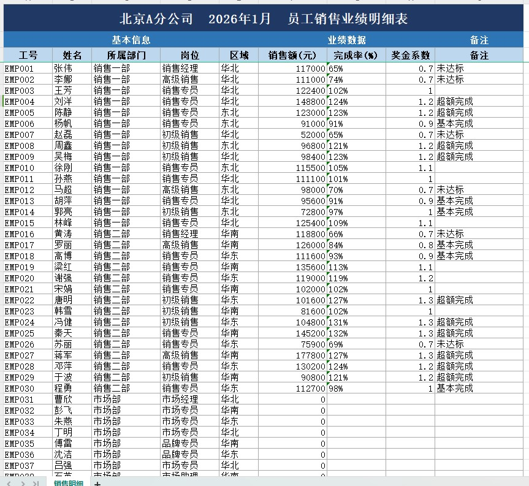
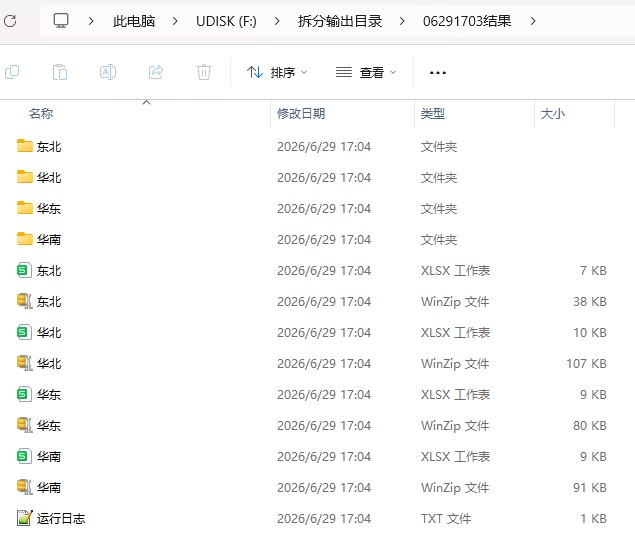

# ExcelRouter · Excel 智能拆分工具

> 整个文件夹一键拆完：按部门、区域、工号等字段自动拆分，保留原格式，自动打包分发。
> 自动识别表头、跨文件合并、零编程，面向普通办公人员。
>
> Batch-split a whole folder of Excel files by any field (department / region / ID),
> keep original formatting, auto-package for distribution — no coding required.
>
> 作者 / Author：AbeLin · 觉得好用请点 ⭐ Star！

[](LICENSE)


---

## ✨ 功能特点 / Features

- **选一个字段就能拆** —— 自动识别表头，下拉选「拆分字段」，每个取值拆成一个文件，无需预先列出。
  *Pick one column and split — auto-detect header, choose a column, one file per value.*
- **三层递进，先易后难** —— 简单 / 进阶 / 专家，按使用者熟练度展开选项。
  *Three difficulty levels (Simple / Advanced / Expert) — progressive disclosure.*
- **跨文件合并** —— 同一个取值出现在多个源文件里，自动**合并到同一个文件**（修掉了旧版互相覆盖的问题）。
  *Cross-file merge — same value across multiple files is merged into one.*
- **二级拆分（按人分发）** —— 可选再按第二列细分（如 部门 → 姓名），一次产出汇总 + 到人双份结果。
  *Optional secondary split (e.g. Department → Person), producing both summary and per-person outputs.*
- **保留格式** —— 表头与数据行的字体、颜色、边框、数字格式、合并表头完整保留。
- **智能识别表头** —— 表头不在第一行也能自动找到（前 15 行启发式扫描）。
- **公式显示真实值** —— 读公式缓存值，并对「未计算的公式」提前预警。
- **多 Sheet / 兼容 .xls / 批量递归** —— 一次处理整个文件夹。
- **大文件不假死** —— 几万行的单文件也有实时进度与心跳日志，界面全程响应（见 [FAQ](docs/FAQ.md#处理大文件几万行时界面卡住像死机了一样是不是崩溃了)）。

> **关于格式保留的两点限制 / Limitations：**
> ① `.xls` 转换后无法保留原格式（仅保留数据）；
> ② 数据区的合并单元格暂不保留（表头的合并单元格正常保留）；
> ③ 跨文件合并按**列位置**追加，最适合「同一套模板的多个表」。
>
> 更多问题见 **[FAQ](docs/FAQ.md)**（杀毒软件误报怎么办、公式列为什么是空的、.xls 支持范围等）。

---

## 🖼️ 演示截图 / Screenshots

**数据源（3 行复杂表头——大标题 / 分组标签 / 列名，工具自动识别表头行）**



**拆分结果（按区域自动分组，每组含汇总 + 到人，整包 ZIP 可直接发负责人）**



---

## 🚀 直接下载使用（无需安装 Python）/ Download

普通用户请直接下载打包好的程序：👉 **[前往 Releases 下载](../../releases)**

每个版本提供两种产物，**优先选 ZIP**：

| 产物 | 说明 | 适用场景 |
|---|---|---|
| `ExcelRouter-vX.X.X-win64.zip` | 文件夹形式，解压后双击里面的 exe | **推荐**，启动更快，极少触发杀毒软件误报 |
| `ExcelRouter-vX.X.X.exe` | 单文件版，下载即用无需解压 | 图方便，但个别杀毒软件可能误报（[why?](docs/FAQ.md#杀毒软件误报)） |

---

## 🧭 三步上手 / Quick Start

1. **选输入文件夹**（放着你要拆的 Excel）和**输出文件夹**。
2. 点 **「🔄 扫描字段」**，在「拆分字段」下拉里选要按哪个字段拆（如「部门」）。
3. 点 **「▶ 开始处理」**。完成后每个取值一个文件，自动打开输出目录。

想试一下？仓库自带样本：

```bash
python examples/make_sample.py   # 生成 5 个月份的虚拟员工明细（1月A分公司明细.xlsx … 5月A分公司明细.xlsx）
```

用工具的「文件夹」模式，输入选 `examples/`，拆分字段选「所属部门」，开启「到人」，
开始处理——每个部门的 5 个月数据自动**跨文件合并**，同时产出按员工姓名细分的个人文件，
整体打包成 ZIP 可直接发给对应负责人。

### 难度分档 / Levels

| 档位 | 你能做的事 |
|------|-----------|
| **简单** | 选拆分字段 → 开始（按该字段所有取值自动拆） |
| **进阶** | 加二级拆分列、只拆部分取值、保留格式 / 精确匹配开关 |
| **专家** | 表头识别策略（自动 / 指定行号 / 关键词）、取值归并映射、跳过值、跨文件合并开关 |

---

## 🛠️ 开发者运行 / Run from source

```bash
git clone https://github.com/MarsandSea/excel-router.git
cd excel-router
pip install -r requirements.txt
python main.py
```

运行测试：

```bash
pip install pytest
pytest -q
```

---

## 📦 自行打包 / Build

直接运行 `build.bat`（onedir + onefile 双产物，已含必需参数），或参考
**[发版手册](docs/RELEASING.md)** 了解 CI 自动发版流程与防误报细节。

> ⚠️ `--collect-all customtkinter` 与 `--add-data "config;config"` 两个参数缺一不可，
> 否则打包后的 exe 会启动崩溃或找不到默认配置。

---

## 📂 项目结构 / Structure

```
excel-router/
├── main.py                  # 入口
├── config/default_config.json
├── core/
│   ├── splitter.py          # 核心拆分逻辑（表头识别 / 列枚举 / 跨文件合并）
│   └── utils.py             # 文本清理 / 取值归并 / 文件名净化
├── gui/app.py               # 三步卡片式图形界面
├── examples/make_sample.py  # 样本生成器
├── docs/                    # FAQ / 发版手册 / 截图
└── tests/                   # pytest 测试
```

---

## ❓ 遇到问题 / Support

先看 **[FAQ](docs/FAQ.md)**，多数问题（杀毒误报、公式列空白、.xls 限制等）都有解释。
没解决再提 [Issue](../../issues)，模板会引导你附上必要信息，处理更快。

**想提建议？** 程序内点「💬 反馈建议」可匿名反馈（1 分钟，不需要注册任何账号），
你的真实使用场景是这个工具迭代的主要依据。

---

## 📄 开源协议 / License

[MIT License](LICENSE)。可自由使用、修改、分发，请保留原作者署名。

## 👤 作者 / Author

**AbeLin** · 有问题欢迎提 [Issue](../../issues)
